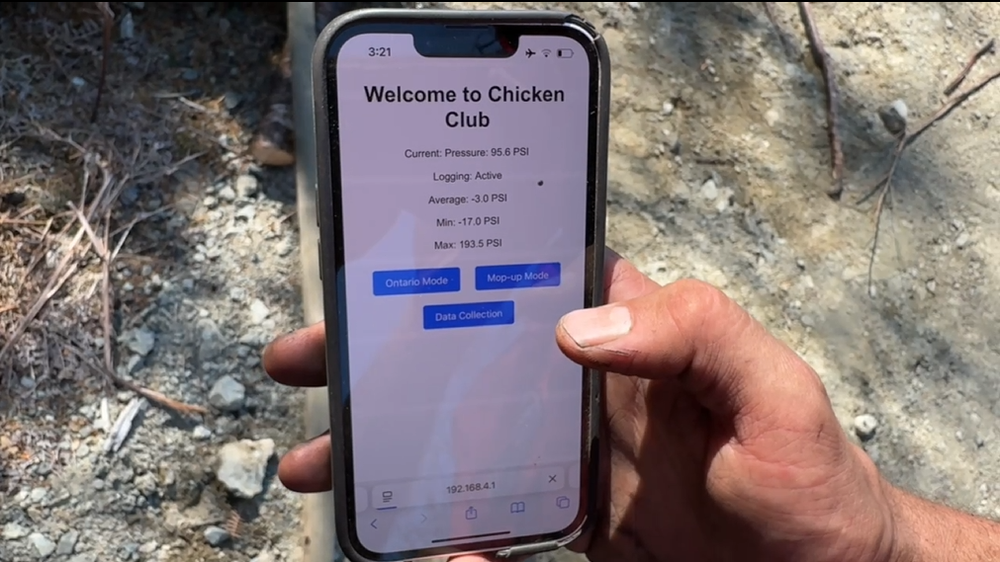
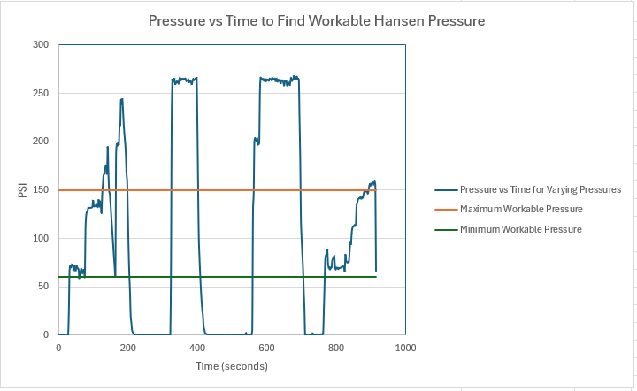

<html lang="en">
<head>
    <meta charset="UTF-8">
    <meta name="viewport" content="width=device-width, initial-scale=1.0">
    <title>CHCU</title>
    
</head>
<body>
    <header>
        <h1>Central Hose Command Unit</h1>
        
A Couple Months of Stoppable Flow

    </header>
    <main>
        <section>
            <h2>An Interesting Problem With a Unique Solution</h2>
            
For years, firefighters have had to go back to the threeway to stop waterflow or manage pressure. All the walking back and forth really adds up
            and makes water delivery require more effort than necessary. To address this issue, the Central Hose Command Unit (CHCU) was created.
            Now firefighters can control the flow of water remotely using their mobile device to engage a linear actuator. The system uses a transmission protocol
            called LoRa that allows for water to be diverted from over 1 km away.

            

                <iframe
                    src="https://www.youtube.com/embed/UoZGK9sne38"
                    allow="accelerometer; autoplay; clipboard-write; encrypted-media; gyroscope; picture-in-picture"
                    allowfullscreen>
                </iframe>
            

        </section>

        <section>
            <h2>Water Diversion</h2>
            
The CHCU provides two types of threeway flips: Full and Incremental.

            <h3>Full</h3>
            
The full threeway flip allows for complete stoppage of water flow so that firefighters can add on another length of hose.

            

                <iframe
                    src="https://www.youtube.com/embed/O6K0zqInA_I"
                    allow="accelerometer; autoplay; clipboard-write; encrypted-media; gyroscope; picture-in-picture"
                    allowfullscreen>
                </iframe>
            

            <h3>Incremental</h3>
            
As a means of managing pressure, the threeway can be opened a certain percentage to allow for pressure relief.

            

                <iframe
                    src="https://www.youtube.com/embed/yZ1eOZ8rw7U"
                    allow="accelerometer; autoplay; clipboard-write; encrypted-media; gyroscope; picture-in-picture"
                    allowfullscreen>
                </iframe>
            

        </section>

        <section>
            <h2>Pressure Readings</h2>
            
The CHCU also sends pressure readings to the user's mobile device every 2 seconds. This is helpful for quickly doing mental math about how many nozzles can be open and
            monitoring if a hose has blown a hole in it.

            

                
            

        </section>

        <section>
            <h2>Data Capture and Analysis</h2>
            
To better understand water pressure and hose behaviour, pressure readings can be logged and saved as an Excel file for further data analysis. One of the experiments
            involved determining minimum and maximum workable pressure for a Hansen nozzle. If the pressure is to high, the hose becomes to difficult to hold. If the pressure is to low, the duff layer cannot be properly pentrated and the fire cannot be extinguished. This may be the first time data like this has been recorded at this level of detail.

            

                
            

        </section>
    </main>
    <footer>
        
&copy; 2025 CHCU. All rights reserved.

    </footer>
</body>
</html>
